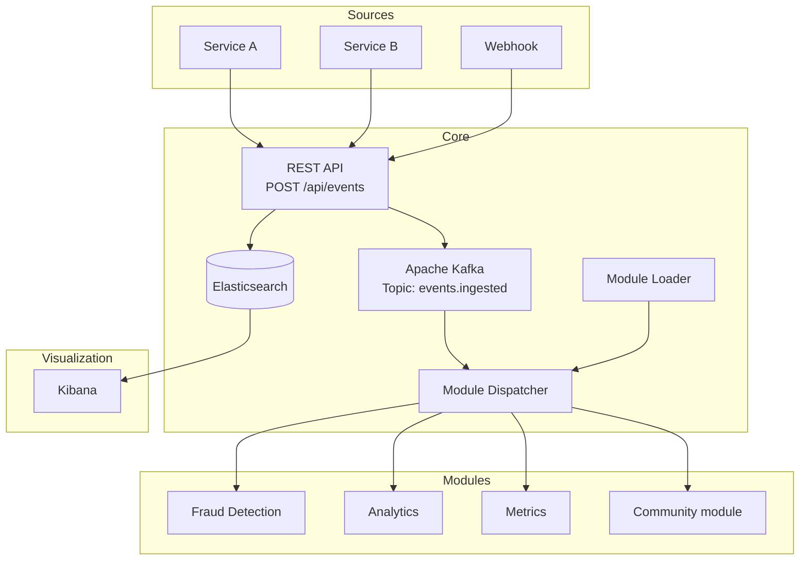

# Architecture

## Overview

## Components

### pme-sdk

The SDK is a lightweight jar with no Spring dependency. It only contains the interfaces and models that module developers need:

- `EventModule` — main contract
- `EventContext` — context provided by the core
- `Event`, `EventType`, `Priority` — data models

### pme-core

The platform engine. It handles:

- **Ingestion** — REST API to receive events
- **Persistence** — Storage in Elasticsearch
- **Publishing** — Sending to Kafka
- **Module Loader** — Module discovery and loading
- **Module Dispatcher** — Event routing to the right modules

### Modules

Each module is an independent jar that implements `EventModule`. The core loads them at startup and dispatches events matching their `subscribesTo`.

## Event flow

1. **Reception** — `POST /api/events` receives a JSON event
2. **Persistence** — The event is indexed in Elasticsearch
3. **Publishing** — The event is published on the Kafka topic `events.ingested`
4. **Dispatch** — The `ModuleDispatcher` routes it to modules whose `EventType` matches
5. **Processing** — Each module executes its logic in `onEvent()`

## Tech stack

| Component | Technology |
|-----------|------------|
| Language | Java 25 |
| Framework | Spring Boot 3.x |
| Message Broker | Apache Kafka |
| Indexing | Elasticsearch |
| Visualization | Kibana |
| Infrastructure | Docker Compose |
