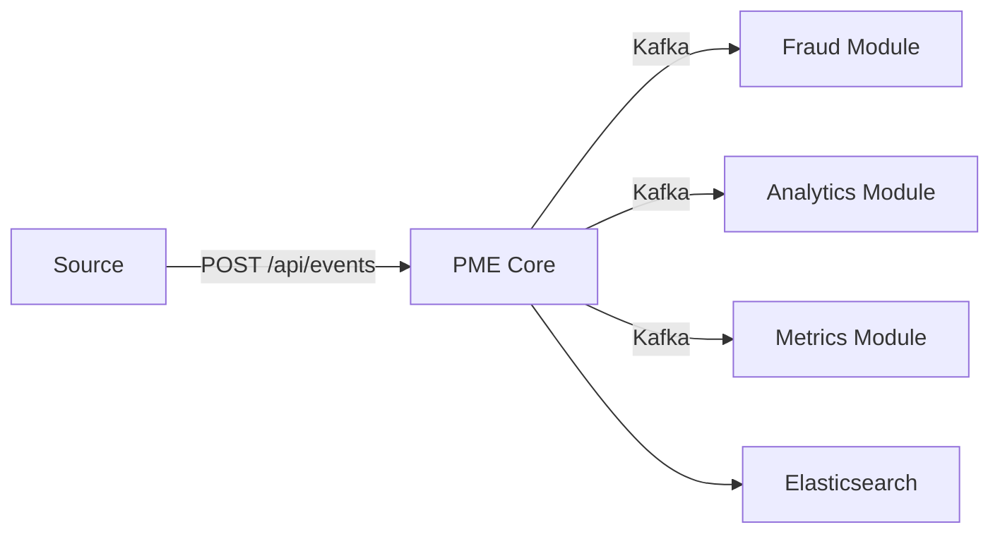

# Processing Modular Events

**PME** is a modular event processing platform. An event-driven engine that ingests events in real-time and distributes them to independent modules.

## Concept

The system works as a pipeline:



1. An event arrives via the **core** REST API
2. The core persists it in **Elasticsearch** and publishes it on **Kafka**
3. Subscribed **modules** receive and process it independently

## Create a module

Use the [**template**](https://github.com/Processing-Modular-Events/pme-module-template) to get started, then edit `module.yml`:

```yaml
name: my-module
version: 1.0.0
author: my-name
description: My module description
priority: MEDIUM
subscribes-to:
  - TRANSACTION
```

And implement `EventModule`:

```java
public class MyModule implements EventModule {

    @Override
    public ModuleConfig config() {
        return ModuleConfigReader.load();
    }

    @Override
    public void onEvent(Event event, EventContext context) {
        context.log("Event received: {}", event.uuid());
    }
}
```

## Quick links

- [Installation](getting-started/installation.md)
- [First module](getting-started/first-module.md)
- [SDK Reference](sdk/index.md)
- [Architecture](architecture/index.md)
