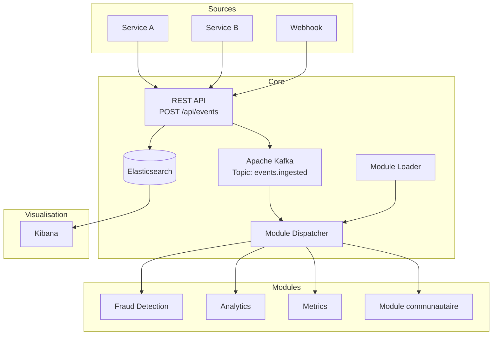

# Architecture

## Vue d'ensemble

## Composants

### pme-sdk

Le SDK est un jar leger sans dependance Spring. Il contient uniquement les interfaces et modeles que les developpeurs de modules doivent connaitre :

- `EventModule` — contrat principal
- `EventContext` — contexte fourni par le core
- `Event`, `EventType`, `Priority` — modeles de donnees

### pme-core

Le moteur de la plateforme. Il gere :

- **Ingestion** — API REST pour recevoir les evenements
- **Persistence** — Stockage dans Elasticsearch
- **Publication** — Envoi sur Kafka
- **Module Loader** — Decouverte et chargement des modules
- **Module Dispatcher** — Routage des evenements vers les bons modules

### Modules

Chaque module est un jar independant qui implemente `EventModule`. Le core les charge au demarrage et leur dispatch les evenements correspondant a leur `subscribesTo`.

## Flux d'un evenement

1. **Reception** — `POST /api/events` recoit un evenement JSON
2. **Persistence** — L'evenement est indexe dans Elasticsearch
3. **Publication** — L'evenement est publie sur le topic Kafka `events.ingested`
4. **Dispatch** — Le `ModuleDispatcher` le route vers les modules dont le `EventType` matche
5. **Traitement** — Chaque module execute sa logique dans `onEvent()`

## Stack technique

| Composant | Technologie |
|-----------|-------------|
| Langage | Java 25 |
| Framework | Spring Boot 3.x |
| Message Broker | Apache Kafka |
| Indexation | Elasticsearch |
| Visualisation | Kibana |
| Infrastructure | Docker Compose |
