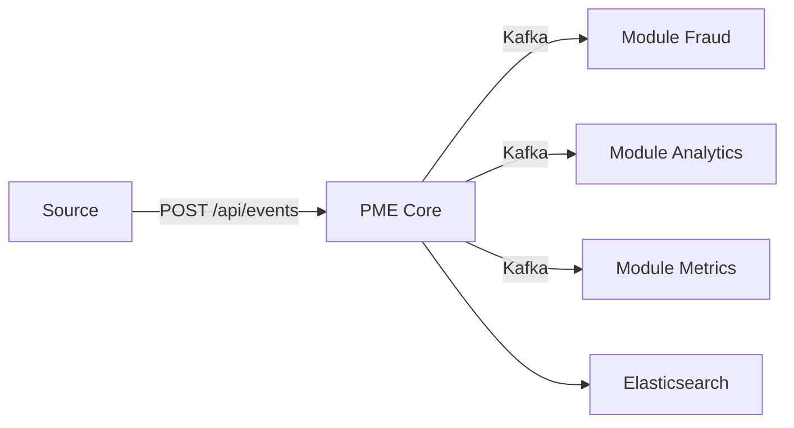

# Processing Modular Events

**PME** est une plateforme de traitement d'evenements modulaire. Un moteur event-driven qui ingere des evenements en temps reel et les distribue a des modules independants.

## Concept

Le systeme fonctionne comme un pipeline :



1. Un evenement arrive via l'API REST du **core**
2. Le core le persiste dans **Elasticsearch** et le publie sur **Kafka**
3. Les **modules** abonnes le recoivent et le traitent de facon isolee

## Creer un module

Utilisez le [**template**](https://github.com/Processing-Modular-Events/pme-module-template) pour demarrer, puis modifiez `module.yml` :

```yaml
name: mon-module
version: 1.0.0
author: mon-nom
description: Description de mon module
priority: MEDIUM
subscribes-to:
  - TRANSACTION
```

Et implementez `EventModule` :

```java
public class MonModule implements EventModule {

    @Override
    public ModuleConfig config() {
        return ModuleConfigReader.load();
    }

    @Override
    public void onEvent(Event event, EventContext context) {
        context.log("Event recu : {}", event.uuid());
    }
}
```

## Liens rapides

- [Installation](getting-started/installation.md)
- [Premier module](getting-started/first-module.md)
- [Reference SDK](sdk/index.md)
- [Architecture](architecture/index.md)
